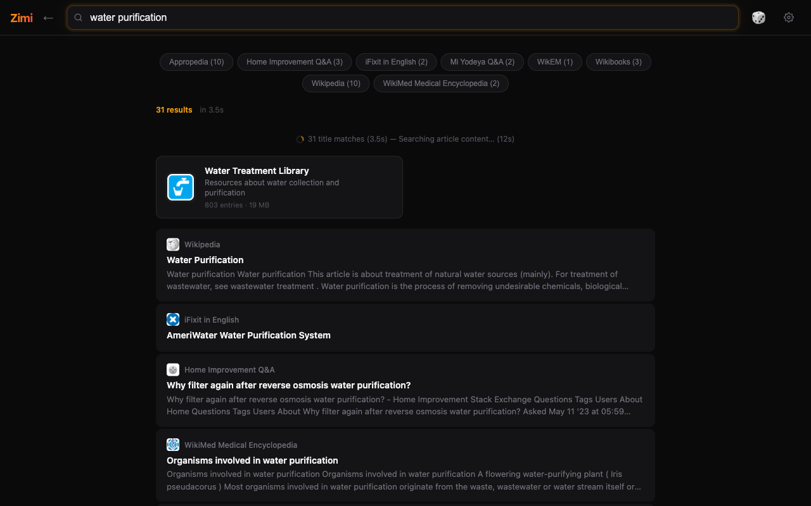
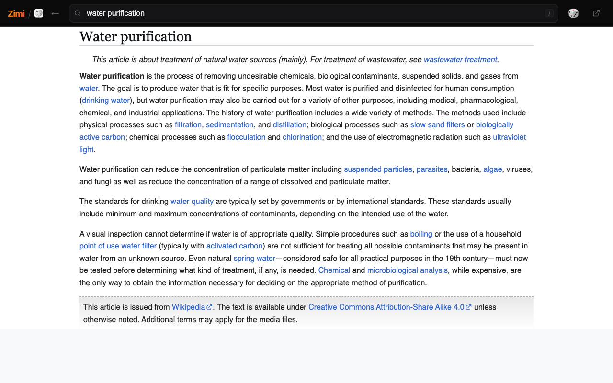
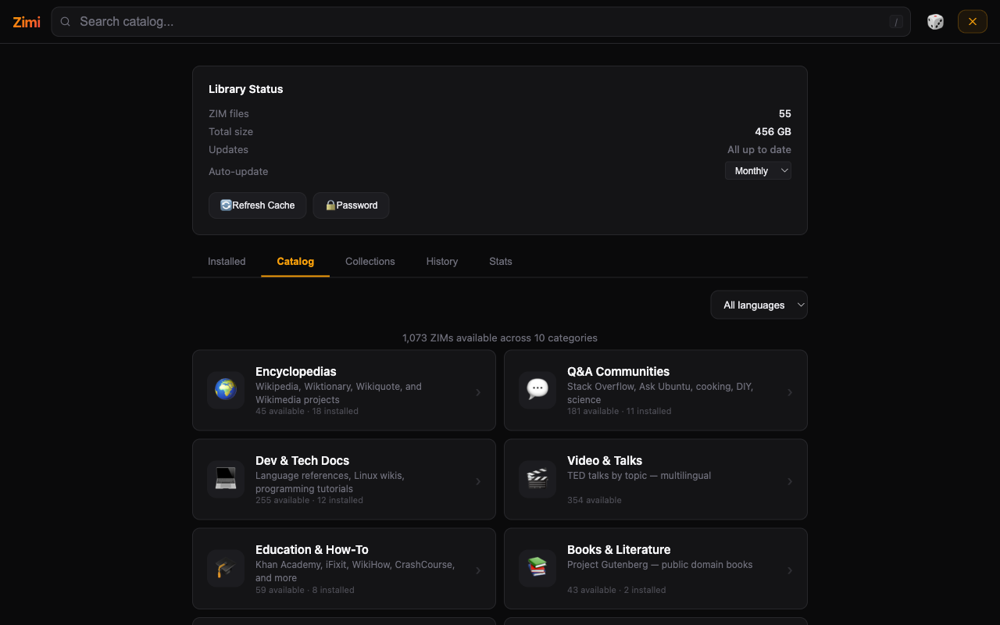
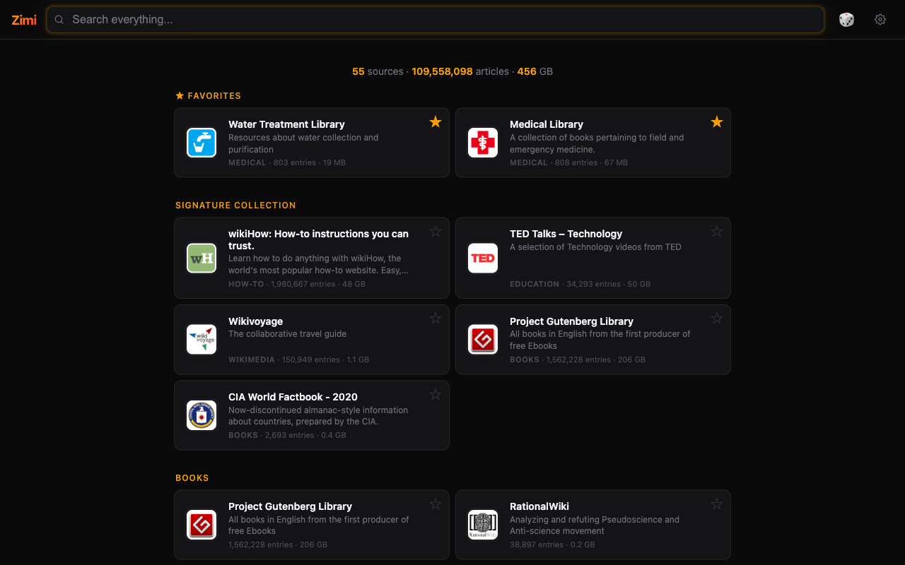

# Zimi

Search and read 100M+ articles offline. Wikipedia, Stack Overflow, dev docs, WikiHow, and thousands more — all on your machine, no internet required.

[Kiwix](https://kiwix.org) packages the world's knowledge into [ZIM files](https://wiki.openzim.org/wiki/ZIM_file_format) — compressed offline archives of entire websites. Zimi is the fastest way to search and read them.

**Three ways to run it:**

- **Docker** — self-host on a NAS, server, or anywhere with one command.
- **Desktop UI** — native window with built-in catalog browser. Requires Python.
- **Python CLI** — run directly if you already have Python installed.

**What you get:**

- **Catalog browser** — visual gallery of 1,000+ available ZIM archives across 10 categories. One-click install.
- **Cross-source search** — search across all your sources at once, with sub-second title matches.
- **Article reader** — clean dark-theme reader with full-text rendering, right in the app.
- **JSON API** — every feature accessible programmatically for scripts, bots, and integrations.
- **MCP server** — plug into Claude Code and other AI agents as a knowledge tool.
- **Collections** — group sources into named sets for scoped search (e.g. "Dev Docs", "Medical").

## Screenshots

| Search Results | Article Reader |
|----------------|----------------|
|  |  |

| Catalog Browser | Homepage |
|-----------------|----------|
|  |  |

## Quick Start

### Docker (easiest)

**Starting fresh?** Run with an empty directory — the catalog browser lets you download ZIMs from the UI:

```bash
mkdir zims
docker run -v ./zims:/zims -p 8899:8899 epheterson/zimi
```

**Already have ZIM files?** Mount them and go:

```bash
docker run -v /path/to/zims:/zims -p 8899:8899 epheterson/zimi
```

Open http://localhost:8899 to search, read, and manage your library.

### Desktop UI (native window)

Runs the full web UI inside a native desktop window. First launch walks you through choosing a ZIM storage folder.

```bash
pip install -r requirements-desktop.txt && python3 zimi_desktop.py
```

### Python CLI

```bash
pip install -r requirements.txt
ZIM_DIR=./zims python3 zimi.py serve --port 8899
```

Or use the CLI directly:

```bash
python3 zimi.py search "water purification" --limit 10
python3 zimi.py read wikipedia "A/Water_purification"
python3 zimi.py list
python3 zimi.py suggest "pytho"
```

## API

Every feature in the UI is backed by a JSON API you can hit directly:

```bash
# Search across all sources
curl "http://localhost:8899/search?q=python+asyncio&limit=5"

# Fast title-only search (instant, no full-text)
curl "http://localhost:8899/search?q=python+asyncio&fast=1"

# Search within a specific source
curl "http://localhost:8899/search?q=linked+list&zim=stackoverflow&limit=10"

# Read an article as plain text
curl "http://localhost:8899/read?zim=wikipedia&path=A/Water_purification"

# Title autocomplete
curl "http://localhost:8899/suggest?q=pytho&limit=5"

# List all sources
curl "http://localhost:8899/list"
```

### All Endpoints

| Endpoint | Description |
|----------|-------------|
| `GET /search?q=...&limit=5&zim=...&fast=1` | Full-text search (cross-ZIM or scoped). `fast=1` returns title matches only. |
| `GET /read?zim=...&path=...&max_length=8000` | Read article as plain text |
| `GET /suggest?q=...&limit=10&zim=...` | Title autocomplete |
| `GET /list` | List all ZIM sources with metadata |
| `GET /catalog?zim=...` | PDF catalog for zimgit-style ZIMs |
| `GET /snippet?zim=...&path=...` | Short text snippet |
| `GET /random?zim=...` | Random article |
| `GET /collections` | List all collections |
| `POST /collections` | Create/update a collection |
| `DELETE /collections?name=...` | Delete a collection |
| `GET /health` | Health check (includes version) |
| `GET /w/<zim>/<path>` | Serve raw ZIM content (HTML, images) |

## MCP Server

Zimi includes an MCP (Model Context Protocol) server that exposes search/read tools to AI agents.

### Claude Code (local)

```json
{
  "mcpServers": {
    "zimi": {
      "command": "python3",
      "args": ["/path/to/zimi_mcp.py"],
      "env": { "ZIM_DIR": "/path/to/zims" }
    }
  }
}
```

### Claude Code (Docker on remote host)

```json
{
  "mcpServers": {
    "zimi": {
      "command": "ssh",
      "args": ["your-server", "docker", "exec", "-i", "zimi", "python3", "/app/zimi_mcp.py"]
    }
  }
}
```

### Available Tools

| Tool | Description |
|------|-------------|
| `search` | Full-text search across all ZIM sources. Supports `collection` parameter. |
| `read` | Read an article as plain text |
| `suggest` | Title autocomplete. Supports `collection` parameter. |
| `list_sources` | List all available sources |
| `random` | Random article |

## Docker Configuration

### Docker Compose

```yaml
services:
  zimi:
    image: epheterson/zimi
    container_name: zimi
    restart: unless-stopped
    ports:
      - "8899:8899"
    volumes:
      - ./zims:/zims
```

### Environment Variables

| Variable | Default | Description |
|----------|---------|-------------|
| `ZIM_DIR` | `/zims` | Path to directory containing ZIM files |
| `ZIMI_DATA_DIR` | `$ZIM_DIR/.zimi` | Data directory for indexes, cache, and config |
| `ZIMI_MANAGE` | `1` | Library manager (browse/download ZIMs). Set to `0` to disable. |
| `ZIMI_MANAGE_PASSWORD` | _(none)_ | Password to protect library management. Can also be set from the UI. |
| `ZIMI_AUTO_UPDATE` | `0` | Auto-update ZIMs. Set to `1` to enable. |
| `ZIMI_UPDATE_FREQ` | `weekly` | Auto-update frequency: `daily`, `weekly`, or `monthly`. |
| `ZIMI_RATE_LIMIT` | `60` | API rate limit (requests/minute per IP). Set to `0` to disable. |

**Forgot your password?** Delete `password` from your data directory (`$ZIMI_DATA_DIR/password`, default `zims/.zimi/password`) and restart.

### Data Directory

Zimi stores its data (metadata cache, title indexes, password, collections) in `ZIMI_DATA_DIR`, which defaults to `.zimi/` inside your ZIM directory.

```
zims/
  .zimi/                  # ZIMI_DATA_DIR
    cache.json            # ZIM metadata cache
    password              # Management password hash
    collections.json      # Saved collections
    titles/               # SQLite title indexes (one per ZIM)
      wikipedia.db
      stackoverflow.db
  wikipedia.zim
  stackoverflow.zim
```

## Getting ZIM Files

ZIM files are compressed offline archives of entire websites. You can download them from the catalog browser in Zimi, or grab them directly:

- **[Kiwix Library](https://library.kiwix.org)** — Browse and download ZIMs
- **[download.kiwix.org](https://download.kiwix.org/zim/)** — Direct downloads

Popular ZIMs:

| Source | Size | Articles |
|--------|------|----------|
| Wikipedia (English, all) | ~100 GB | 6.8M |
| Stack Overflow | ~75 GB | 31M |
| Wikipedia (English, top) | ~12 GB | 200K |
| DevDocs | ~0.5 GB each | varies |
| WikiHow | ~4 GB | 240K |

Place `.zim` files in your ZIM directory and restart Zimi (or hit refresh in the UI).

## Architecture

- **`zimi.py`** — HTTP server + CLI + core library (search, read, suggest, random)
- **`zimi_mcp.py`** — MCP server wrapping core functions for AI agent integration
- **`zimi_desktop.py`** — Desktop app wrapper using pywebview (native window)
- **`templates/index.html`** — Single-page web UI (vanilla JS, no build step)
- **`tests.py`** — Unit and integration tests

### Search

Search uses a two-phase progressive approach:

1. **Phase 1 (fast):** Parallel title prefix search across all ZIMs using SQLite indexes. Results appear in <1s.
2. **Phase 2 (full):** Sequential Xapian full-text search under global lock. Results merge with Phase 1.

SQLite title indexes are built automatically in the background on first startup. Connection pooling and pre-warming eliminate cold-start latency.

**Storage:** Title indexes use roughly 2-3% of your total ZIM size on disk (e.g. ~15 GB for 575 GB of ZIMs). They are stored in `ZIMI_DATA_DIR/titles/` and can be safely deleted — they'll rebuild on next startup.

### Desktop App — Build from Source

```bash
pip install -r requirements-desktop.txt
pyinstaller --noconfirm zimi_desktop.spec
open dist/Zimi.app  # macOS
```

See [RELEASING.md](RELEASING.md) for detailed build instructions and platform notes.

## Tests

```bash
# Unit tests (no server needed)
python3 tests.py

# Performance tests (requires running server)
python3 tests.py --perf --perf-host http://localhost:8899
```

## License

[MIT](LICENSE)
