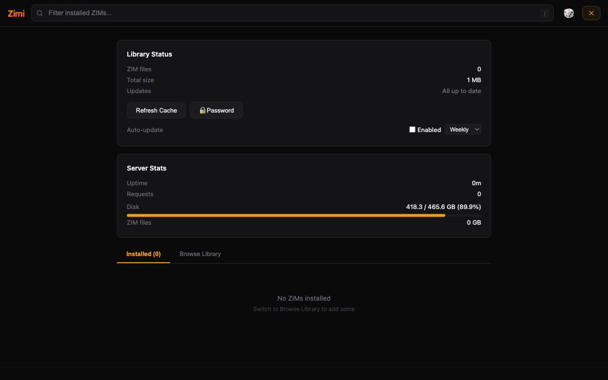

# Zimi

Search and read 100M+ articles offline. API-first knowledge server for [ZIM files](https://wiki.openzim.org/wiki/ZIM_file_format).

[Kiwix](https://kiwix.org) packages the world's knowledge into ZIM files — offline archives of Wikipedia, Stack Overflow, dev docs, and thousands of other sources. Zimi makes them fly:

- **JSON API** for AI agents — search, read, and browse articles programmatically
- **MCP server** for Claude Code and other AI tool integrations
- **Web UI** for humans — dark theme, cross-source search, in-browser reader
- **Library manager** — browse the Kiwix catalog and download ZIMs from the UI
- **Browse library** — visual category gallery for discovering ZIMs across 9 curated categories
- **Desktop app** — native window for macOS, Windows, and Linux (no Docker required)
- **Collections** — group ZIMs into named sets for scoped search
- **Fast search** — sub-second title matches across all sources, then full-text results

## Screenshots

| Homepage | Search Results |
|----------|---------------|
|  |  |

| Article Reader | Browse Library |
|----------------|----------------|
|  |  |

| Library Manager |
|-----------------|
|  |

## Quick Start (Docker)

**Have ZIM files already?** Mount them and go:

```bash
docker run -v /path/to/zims:/zims -p 8899:8899 epheterson/zimi
```

**Starting fresh?** Run with an empty directory — the built-in library manager lets you browse and download ZIMs directly:

```bash
mkdir zims
docker run -v ./zims:/zims -p 8899:8899 epheterson/zimi
```

Open http://localhost:8899, click the gear icon, and browse the Kiwix catalog to download your first ZIM.

Hit the API directly:

```bash
curl "http://localhost:8899/search?q=water+purification&limit=3"
```

## API

| Endpoint | Description |
|----------|-------------|
| `GET /search?q=...&limit=5&zim=...&fast=1` | Full-text search (cross-ZIM or scoped). `fast=1` returns title matches only. |
| `GET /read?zim=...&path=...&max_length=8000` | Read article as plain text |
| `GET /suggest?q=...&limit=10&zim=...` | Title autocomplete |
| `GET /list` | List all ZIM sources with metadata |
| `GET /catalog?zim=...` | PDF catalog for zimgit-style ZIMs |
| `GET /snippet?zim=...&path=...` | Short text snippet |
| `GET /random?zim=...` | Random article |
| `GET /collections` | List all collections |
| `POST /collections` | Create/update a collection |
| `DELETE /collections?name=...` | Delete a collection |
| `GET /health` | Health check (includes version) |
| `GET /w/<zim>/<path>` | Serve raw ZIM content (HTML, images) |

### Examples

```bash
# Search across all sources
curl "http://localhost:8899/search?q=python+asyncio&limit=5"

# Fast title-only search (instant results, no full-text)
curl "http://localhost:8899/search?q=python+asyncio&fast=1"

# Search within a specific source
curl "http://localhost:8899/search?q=linked+list&zim=stackoverflow&limit=10"

# Read an article
curl "http://localhost:8899/read?zim=wikipedia&path=A/Water_purification"

# Title autocomplete
curl "http://localhost:8899/suggest?q=pytho&limit=5"

# List all sources
curl "http://localhost:8899/list"

# Random article
curl "http://localhost:8899/random"
```

## MCP Server

Zimi includes an MCP (Model Context Protocol) server that exposes search/read tools to AI agents.

### Claude Code (local)

Add to your Claude Code MCP settings:

```json
{
  "mcpServers": {
    "zimi": {
      "command": "python3",
      "args": ["/path/to/zimi_mcp.py"],
      "env": { "ZIM_DIR": "/path/to/zims" }
    }
  }
}
```

### Claude Code (Docker on remote host)

```json
{
  "mcpServers": {
    "zimi": {
      "command": "ssh",
      "args": ["your-server", "docker", "exec", "-i", "zimi", "python3", "/app/zimi_mcp.py"]
    }
  }
}
```

### Available Tools

| Tool | Description |
|------|-------------|
| `search` | Full-text search across all ZIM sources. Supports `collection` parameter. |
| `read` | Read an article as plain text |
| `suggest` | Title autocomplete. Supports `collection` parameter. |
| `list_sources` | List all available sources |
| `random` | Random article |

## CLI

```bash
# Search
python3 zimi.py search "water purification" --limit 10

# Read an article
python3 zimi.py read wikipedia "A/Water_purification"

# List sources
python3 zimi.py list

# Title autocomplete
python3 zimi.py suggest "pytho"

# Start HTTP server
python3 zimi.py serve --port 8899

# Start with native desktop window (requires pywebview)
python3 zimi.py serve --ui
```

## Docker

### Docker Compose

```yaml
services:
  zimi:
    image: epheterson/zimi
    container_name: zimi
    restart: unless-stopped
    ports:
      - "8899:8899"
    volumes:
      - ./zims:/zims
```

### Environment Variables

| Variable | Default | Description |
|----------|---------|-------------|
| `ZIM_DIR` | `/zims` | Path to directory containing ZIM files |
| `ZIMI_DATA_DIR` | `$ZIM_DIR/.zimi` | Data directory for indexes, cache, and config |
| `ZIMI_MANAGE` | `1` | Library manager (browse/download ZIMs). Set to `0` to disable. |
| `ZIMI_MANAGE_PASSWORD` | _(none)_ | Password to protect library management. Can also be set from the UI. |
| `ZIMI_AUTO_UPDATE` | `0` | Auto-update ZIMs. Set to `1` to enable. |
| `ZIMI_UPDATE_FREQ` | `weekly` | Auto-update frequency: `daily`, `weekly`, or `monthly`. |
| `ZIMI_RATE_LIMIT` | `60` | API rate limit (requests/minute per IP). Set to `0` to disable. |

**Forgot your password?** Delete `password` from your data directory (`$ZIMI_DATA_DIR/password`, default `zims/.zimi/password`) and restart the container.

### Data Directory

Zimi stores its data (metadata cache, title indexes, password, collections) in `ZIMI_DATA_DIR`, which defaults to `.zimi/` inside your ZIM directory. On upgrade from v1.1, legacy files (`.zimi_password`, `.zimi_cache.json`, `.zimi_collections.json`) are automatically migrated.

```
zims/
  .zimi/                  # ZIMI_DATA_DIR
    cache.json            # ZIM metadata cache
    password              # Management password hash
    collections.json      # Saved collections
    titles/               # SQLite title indexes (one per ZIM)
      wikipedia.db
      stackoverflow.db
      ...
  wikipedia.zim
  stackoverflow.zim
  ...
```

## Library Manager

The built-in library manager is enabled by default (gear icon in the web UI). You can:

- Browse the Kiwix catalog
- Download ZIMs directly
- Check for updates to installed ZIMs
- Refresh the library cache

Management API endpoints:

| Endpoint | Description |
|----------|-------------|
| `GET /manage/status` | Library status (count, total size) |
| `GET /manage/catalog?q=...` | Browse Kiwix catalog |
| `GET /manage/check-updates` | Check for ZIM updates |
| `GET /manage/downloads` | Active download status |
| `POST /manage/download` | Start a ZIM download |
| `POST /manage/refresh` | Re-scan and rebuild cache |
| `GET /manage/stats` | Server metrics (requests, latency, cache, title index status) |
| `POST /manage/delete` | Delete a ZIM file |
| `POST /manage/update` | Update a ZIM to latest version |
| `POST /manage/cancel` | Cancel an active download |
| `POST /manage/build-fts` | Build FTS5 index for a ZIM (on-demand deep search) |
| `POST /manage/auto-update` | Configure auto-update (enable/disable, frequency) |

## Collections

Collections let you group ZIMs into named sets for scoped search. For example, create a "Dev" collection with Stack Overflow and DevDocs, then search only those sources.

- Create and manage collections from the **Collections** tab in the library manager
- ZIMs are organized by category (Wikimedia, Stack Exchange, Dev Docs, etc.)
- Use collections in the API with `?zim=collection:Dev` or via MCP tools
- Collections are stored in `ZIMI_DATA_DIR/collections.json`

## Getting ZIM Files

ZIM files are offline archives of websites. Download them from:

- **[Kiwix Library](https://library.kiwix.org)** — Browse and download ZIMs
- **[download.kiwix.org](https://download.kiwix.org/zim/)** — Direct downloads

Popular ZIMs:

| Source | Size | Articles |
|--------|------|----------|
| Wikipedia (English, all) | ~100 GB | 6.8M |
| Stack Overflow | ~75 GB | 31M |
| Wikipedia (English, top) | ~12 GB | 200K |
| DevDocs | ~0.5 GB each | varies |
| WikiHow | ~4 GB | 240K |

Place `.zim` files in your ZIM directory and restart Zimi (or use the refresh endpoint).

## Desktop App

Run Zimi as a native desktop application — no Docker or terminal required.

### Install

Download the latest release for your platform from [GitHub Releases](https://github.com/epheterson/Zimi/releases):

- **macOS:** `Zimi.dmg`
- **Windows:** `zimi-windows-amd64.zip`
- **Linux:** `zimi-linux-amd64.tar.gz`

On first launch, Zimi prompts you to choose a folder for storing ZIM files, then opens the full web UI in a native window.

### Build from Source

```bash
pip install -r requirements-desktop.txt
pyinstaller --noconfirm zimi_desktop.spec
open dist/Zimi.app  # macOS
```

See [RELEASING.md](RELEASING.md) for detailed build instructions and platform notes.

## Architecture

- **`zimi.py`** — HTTP server + CLI + core library (search, read, suggest, random)
- **`zimi_mcp.py`** — MCP server wrapping core functions for AI agent integration
- **`zimi_desktop.py`** — Desktop app wrapper using pywebview (native window)
- **`templates/index.html`** — Single-page web UI (vanilla JS, no build step)
- **`tests.py`** — Unit and integration tests

Zimi uses Python's built-in `http.server.ThreadingHTTPServer` with a global lock around all libzim operations (the C library is not thread-safe). Title searches use separate per-ZIM locks for parallel execution. Non-ZIM endpoints remain responsive under concurrent load.

### Search Architecture

Search uses a two-phase progressive approach:

1. **Phase 1 (fast):** Parallel title prefix search across all ZIMs using SQLite indexes. Results appear in <1s.
2. **Phase 2 (full):** Sequential Xapian full-text search under global lock. Results merge with Phase 1.

SQLite title indexes are built automatically in the background on first startup. Connection pooling and pre-warming eliminate cold-start latency.

**Storage:** Title indexes use roughly 2–3% of your total ZIM size on disk (e.g. ~15 GB for 575 GB of ZIMs). They are stored in `ZIMI_DATA_DIR/titles/` and can be safely deleted — they'll rebuild on next startup.

## Tests

```bash
# Unit tests (no server needed)
python3 tests.py

# Performance tests (requires running server)
python3 tests.py --perf --perf-host http://localhost:8899
```

## License

[MIT](LICENSE)
